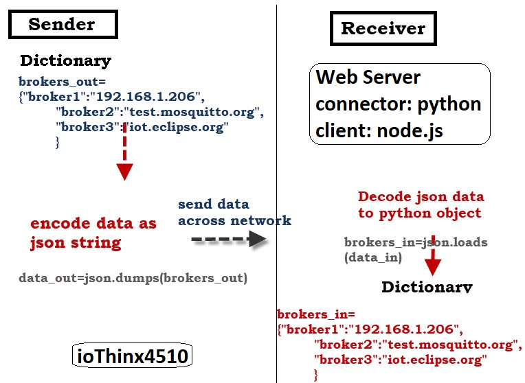
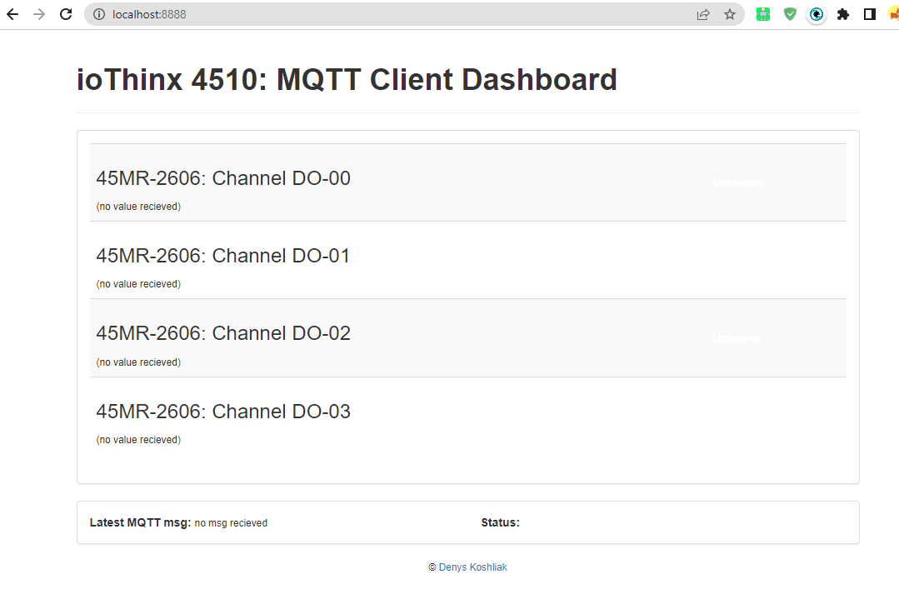

# MQTT dashboard for ioThinx 4510
This repository contains MQTT resources for ioThinx 4510.

### Principle


### Dashboard



Requirements
---
- ioThinx 4510
    - Firmware: V1.1.0_Build19043017
        - Slot: 45MR-2606
- Python 3.4+
- Eclipse Paho™ MQTT Python Client
- MQTT Client Dashboard
    - Node.js 
Getting Started
---

### Installation

#### MQTT Client (Python)
Install Paho MQTT Python client library using pip:

##### MQTT Client (Node.js)

### Example

Define MQTT parameters.

```python
MQTT_HOST = "<MQTT Broker>"
MQTT_PORT = <value> # default: 1883
MQTT_KEEPALIVE = <value> # default: 30s
MQTT_TOPIC = 'ioThinx_4510/#' # Subscribe to all messages from ioThinx 4510
```

This publisher script will change the ```D0-00``` value to ```1``` on the ioThinx-4510 (45MR-2606). 

```
$ python ioThinx-4510-45MR-2606-pub.py -t 00 -v 1
```

